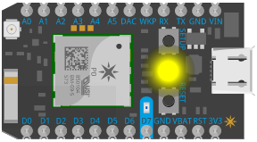
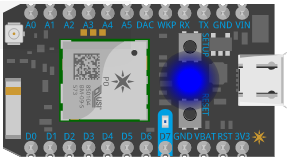
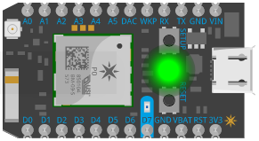

Particle Photon Recovery Tutorial
=================================

On devices with deprecated firmware, `particle identify` will not be able to determine the firmware version. The following is the procedure to restore such devices.

> _**NOTE:** The following procedure requires the Particle CLI and a serial connection via USB._

Step 1 - Confirm
----------------

Identify the device to get the `device id`, and to confirm whether or not your device has the deprecated firmware.

```bash
$ particle identify

Your device id is <xxxxxxxxxxxxxxxxxxxxxxxx>
Unable to determine system firmware version
```

> _**NOTE:** The device above has deprecated firmware, because it reports, "Unable to determine system firmware version"._

Step 2 - Setup the device
-------------------------

Setting up the device performs three important actions...

- logs the CLI into your Particle account
- connects the device to your local Wi-Fi
- claims the device to your Particle account

Now you have the ability to update the firmware!

```bash
$ particle setup
 _ __             _   _      _
| '_ \  __ _ _ __| |_(_) ___| | ___
| |_) |/ _` | '__| __| |/ __| |/ _ \
|  __/| (_| | |  | |_| | (__| |  __/
|_|    \__,_|_|   \__|_|\___|_|\___|
                 https://particle.io

> Setup is easy! Let's get started...
...
```

The wizard will prompt you for all the details you will need.

Step 3 - Enter "DFU Mode"
-------------------------------

To enter DFU Mode:

1. Hold down BOTH buttons (SETUP and RESET)
1. Release only the RESET button, while holding down the SETUP button.
1. Wait for the LED to start flashing yellow (it will flash magenta first)
1. Release the SETUP button



_(imagine a blinking LED...)_

[Photon Documentation](https://docs.particle.io/guide/getting-started/modes/photon/#dfu-mode-device-firmware-upgrade-)  

Step 4 - Update firmware
------------------------

Next we will attempt to update the firmware via the Particle CLI. The update will **FAIL**, but this is necessary to allow for the side-loading of firmware in the following steps.

```bash
$ particle update

> Your device is ready for a system update.
> This process should take about 50 seconds. Here it goes!


! An error occurred while attempting to update the system firmware of your device:

dfu-util: Invalid DFU suffix signature
dfu-util: A valid DFU suffix will be required in a future dfu-util release!!!

dfu-util: Error during download get_status


> Please visit our community forums for help with this error:
https://community.particle.io/
Cannot read property 'code' of undefined
```

> _**NOTE:** The error above is a result of your deprecated firmware. The device will now be breathing magenta, which means the device is in "Safe Mode"._

Step 5 - Enter "Listening Mode"
-------------------------------

To put your Photon in Listening Mode, hold the `SETUP` button for three seconds, until the RGB LED begins blinking blue.



_(imagine a blinking LED...)_

[Photon Documentation](https://docs.particle.io/guide/getting-started/modes/photon/#listening-mode)  

Step 6 - Side-load firmware
---------------------------

When a device has the deprecated firmware, it cannot receive firmware updates over the air (OTA). Therefore it becomes necessary to side-load firmware via the Particle CLI.

We will load a supported, stable firmware version, then receive the remaining updates OTA.

**Firmware:** [bootloader-0.7.0-photon.bin](./obj/bootloader-0.7.0-photon.bin)

```bash
$ particle flash --serial bootloader-0.7.0-photon.bin
! PROTIP: Hold the SETUP button on your device until it blinks blue!
? Press ENTER when your device is blinking BLUE 
sending file: /<absolute/path/to/file>/bootloader-0.7.0-photon.bin

Flash success!
```

Step 7 - Recover from Mystery Mode
---------------------

Call Scooby and the gang, because you have entered the mystery mode, solid green!



To break free you will need to enter DFU mode and update the firmware again (see steps 3 and 4). However this time you will see much more promising output.

```bash
$ particle update
 
> Your device is ready for a system update.
> This process should take about 50 seconds. Here it goes!

! System firmware update successfully completed!

> Your device should now restart automatically.
```

[Particle Forum Discussion](https://community.particle.io/t/photon-unresponsive-solid-green-light/13369/52)

Step 8 - Eureka!???
----------------

When it reboots, you will find yourself in an infinite loop; blue onboard LED on, magenta, blue onboard LED off, breathe white, green and repeat.

PUT THE GUN DOWN...

Yes, the Photon is in an infinite loop, but you can fix it; you will need to break the cycle manually. In order to do so, pull the plug (power down) while the status LED is showing magenta. Take a deep breath, steady your nerves, then plug it back in.

If you caught it at the right time, your Photon will be breathing cyan and you should be good to go!

I know it sounds crazy, but...


